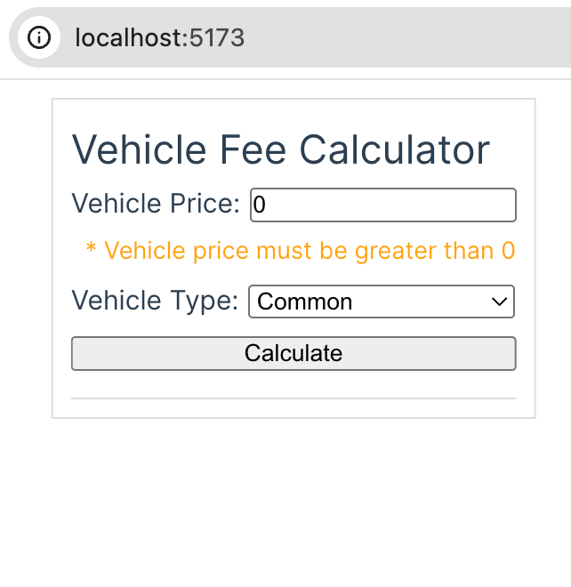
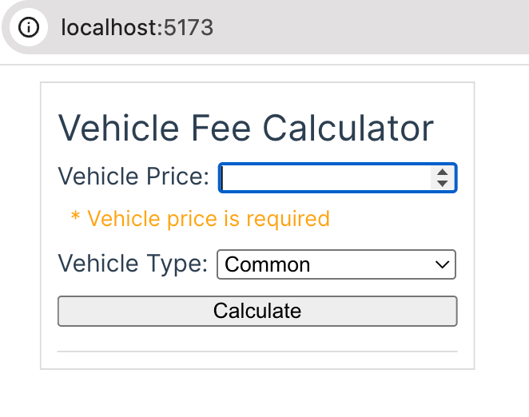
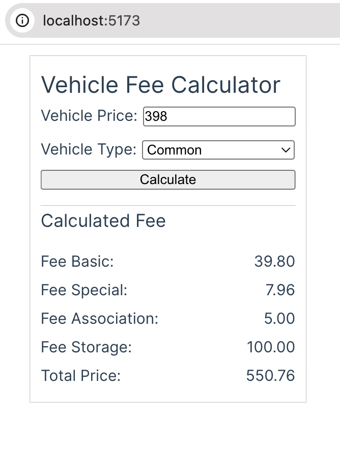
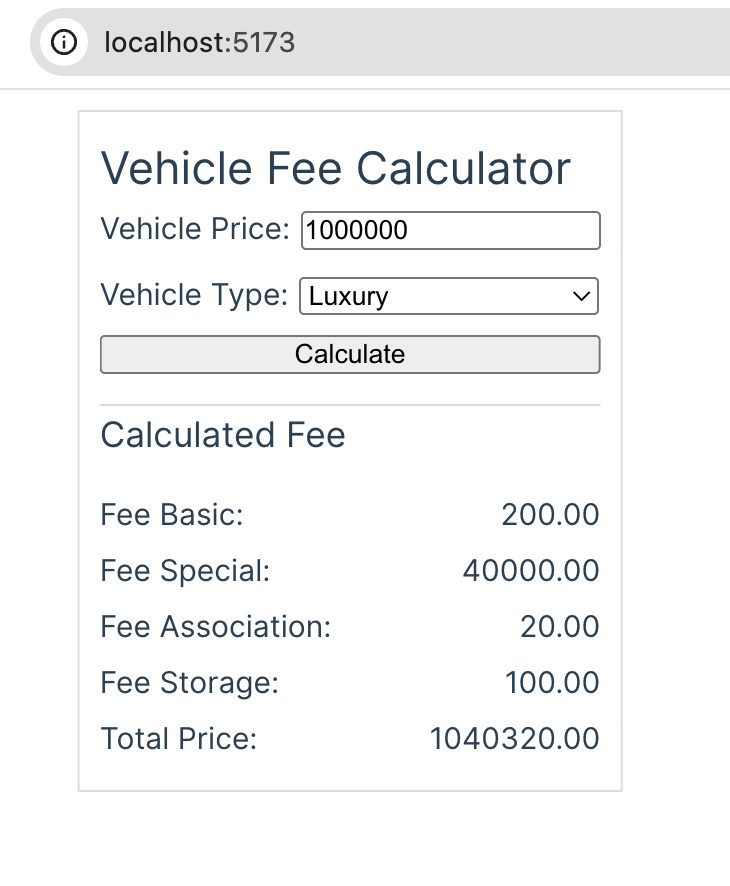

### How to run project

1. Go to *project_folder* and run
````
symfony serve
````

2. Go to *project_folder/frontend* and run
````
npm run dev
````

3. API available at http://127.0.0.1:8000/api/calculate
4. Vue app available at http://localhost:5173
5. Open http://localhost:5173 in the browser → you’ll see the form.
   Vue will call Symfony’s API at http://127.0.0.1:8000/api/calculate

# Results:

1. Initial page load
   <br/>

2. No vehicle prise selected
   <br/>


3. Example for vehicle type "Common"
   <br/>


3. Example for vehicle type "Luxury"
   <br/>

